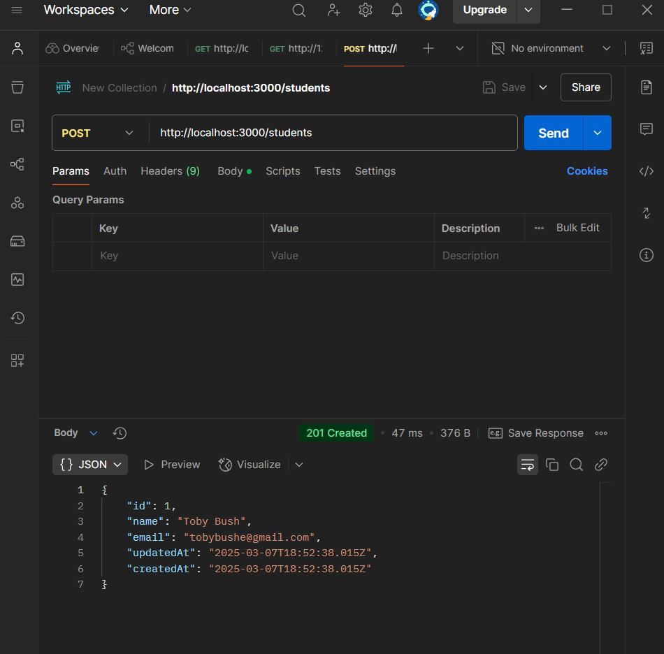
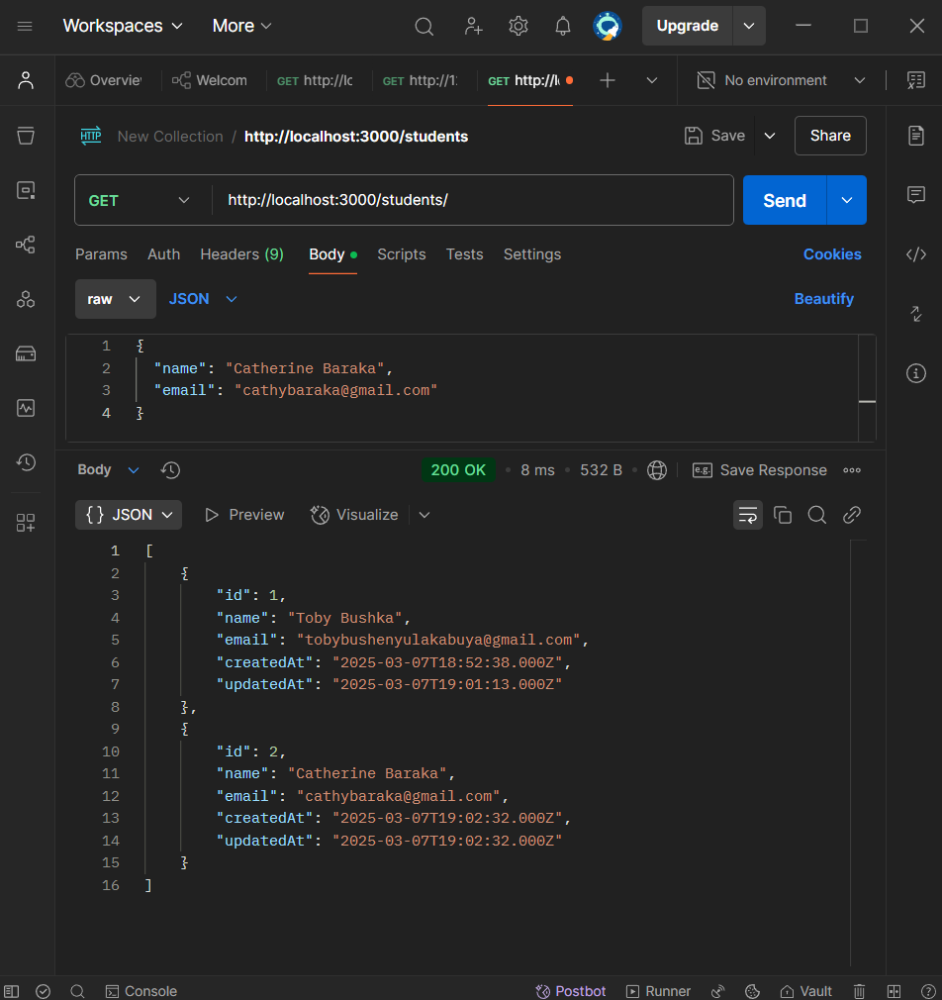
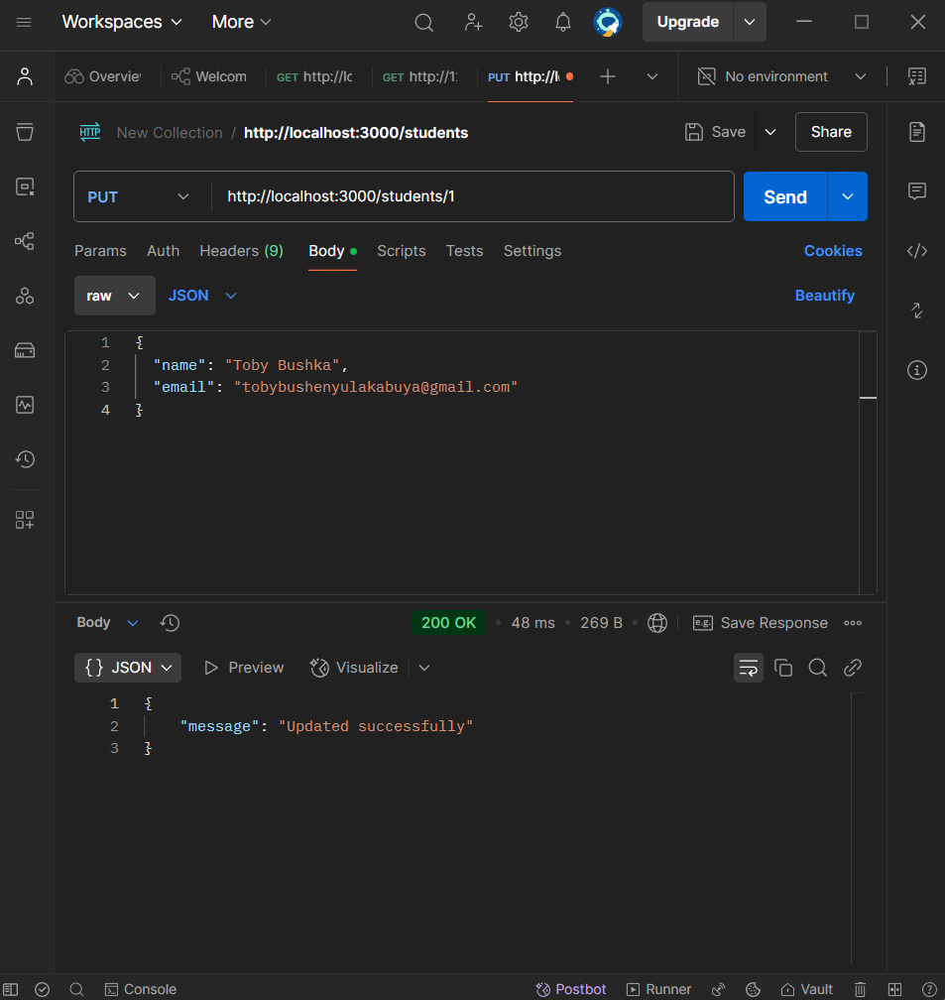
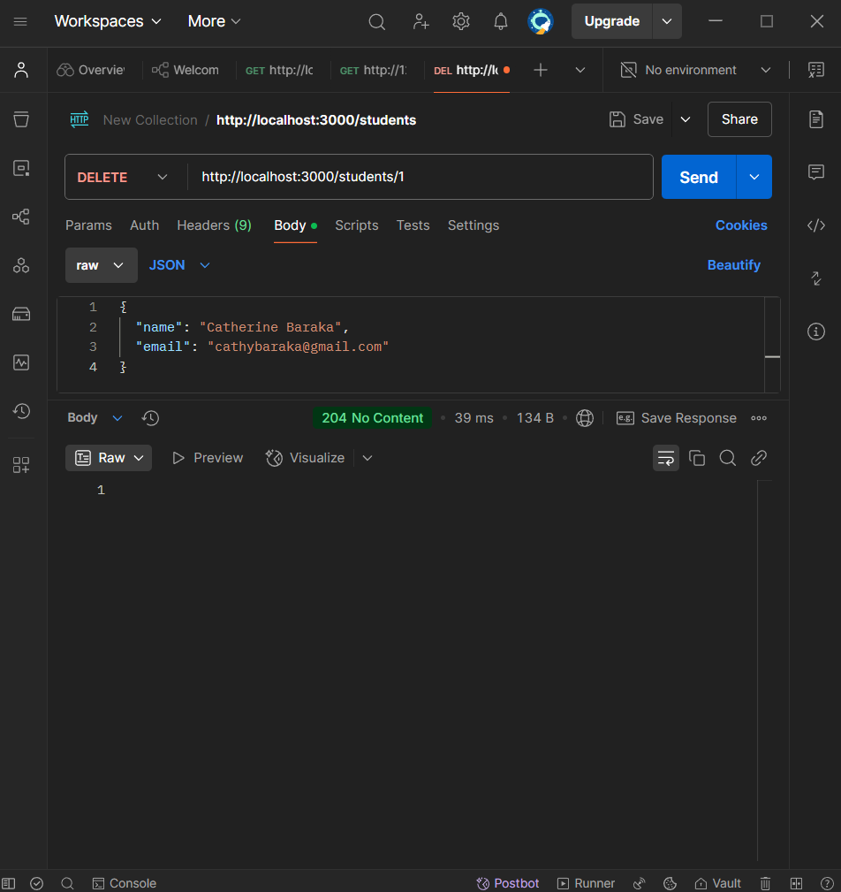

# Database_migration_node_js

## Migration commands:

For the three chosen tables that I chosed to create, I used speific commands. In order to create the migration files, I used the following command:

- **for Students table**:
  npx sequelize-cli migration:generate --name create-students
- **for Teachers table**:
  npx sequelize-cli migration:generate --name create-teachers
-**for Courses table**:
  npx sequelize-cli migration:generate --name create-courses

For each of them, I had to define tablr schema in the migration files. Then next step is to run the migration in order for the database to be created based on the specificstions. 

## CRUD Operations with Sequelize Models:

In this project, the CRUD operations were aplied to the database via sequelize(noting that we are using MySQL database for this project in order to store our data). 

## Implementing CRUD Routes in Express:

The routes were created in Express. these allows to create, read, update and delete data in the database, via API commands. This makes possible to apply the CRUD operations to the database from any platfom that we want.

## CRUD Operations with Postman:

In this project, the CRUD operations were aplied to the database via Postman and here are th edifferent pictures showing the different methods being used on the database successfully: 

THIS IS THE POST METHOD:

THIS IS THE GET METHOD:

THIS IS THE PUT METHOD:

THIS IS THE DELETE METHOD:

## Challenges faced and Solution found:

I had to resetart the entire wor because one of the table was not able to be migrated, this because the up method could not be found. After doing research, I came to realize that it was the incompatibility of the node.js that I had on my PC, with the sequelize version installed. So To solve that issue, I had to uninstall the version 22.24.1 and install the version 16 of node. 

Another one was that I was not able to run the server in order to access the database via Postman. this was resolved when I created an app.js file that is the root file, and run it with the command "node app.js".

